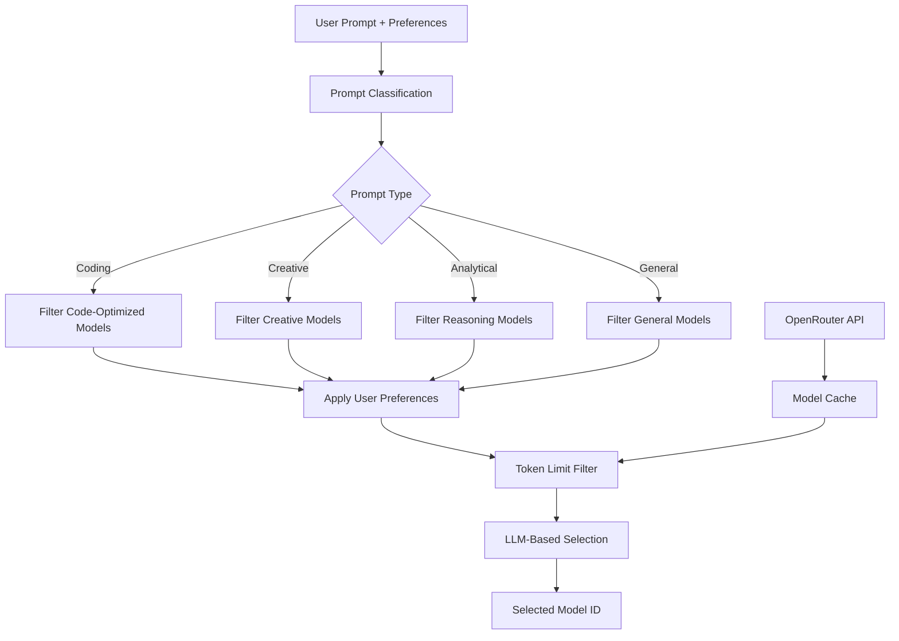
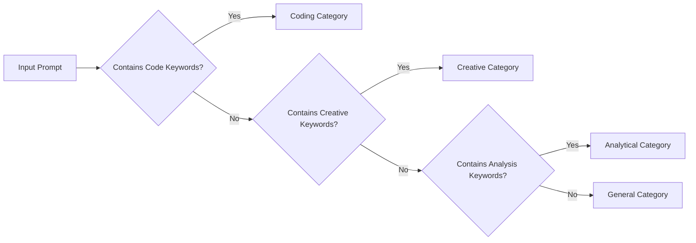
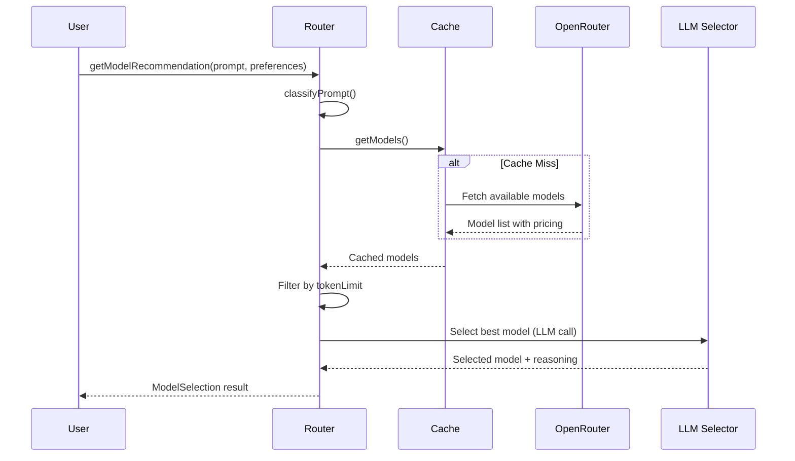

# Auto LLM Selector

An intelligent LLM router that automatically selects the best model for your prompts based on content analysis and user preferences.

## Overview

Auto LLM Selector analyzes your prompts and intelligently routes them to the most suitable LLM model from OpenRouter's catalog. It considers factors like prompt complexity, cost sensitivity, speed requirements, and reasoning needs to make optimal model selections.



## Features

- **🧠 Intelligent Classification**: Automatically categorizes prompts (Coding, Creative, Analytical, General)
- **⚡ Smart Model Selection**: Uses LLM-based selection for optimal model matching
- **💰 Cost-Aware**: Considers pricing in model selection based on your preferences
- **🚀 Performance Optimized**: Caches model data and supports fast selection
- **🔧 Highly Configurable**: Customizable selection criteria and fallback options
- **📊 Analytics Ready**: Provides confidence scores and selection reasoning

## Installation

```bash
npm install auto-llm-selector
# or
pnpm add auto-llm-selector
# or
yarn add auto-llm-selector
```

## Quick Start

```typescript
import { AutoPromptRouter } from 'auto-llm-selector'

const router = new AutoPromptRouter({
    OPEN_ROUTER_API_KEY: process.env.OPEN_ROUTER_API_KEY!,
    selectorModel: 'openai/gpt-4o-mini',
    enableLogging: true
})

await router.initialize()

const selection = await router.getModelRecommendation(
    'Write a function to sort an array in JavaScript',
    {
        accuracy: 0.8,    // High accuracy needed
        cost: 0.4,        // Cost sensitive
        speed: 0.7,       // Need reasonably fast response
        tokenLimit: 4000, // Max tokens for response
        reasoning: false  // Simple coding task
    }
)

console.log(`Selected model: ${selection.model}`)
console.log(`Reason: ${selection.reason}`)
console.log(`Confidence: ${selection.confidence}`)
```

## Use Cases

### 1. Code Generation
```typescript
const codeSelection = await router.getModelRecommendation(
    'Create a REST API with Express.js and TypeScript',
    {
        accuracy: 0.9,    // Need high quality code
        cost: 0.3,        // Budget conscious
        speed: 0.6,       // Moderate speed
        tokenLimit: 8000, // Large response needed
        reasoning: true   // Complex architecture decisions
    }
)
// Likely selects: Code-specialized model like CodeLlama or GPT-4
```

### 2. Creative Writing
```typescript
const creativeSelection = await router.getModelRecommendation(
    'Write a short story about time travel',
    {
        accuracy: 0.7,     // Creative freedom over precision
        cost: 0.8,         // Cost less important for creativity
        speed: 0.4,        // Quality over speed
        tokenLimit: 12000, // Long-form content
        reasoning: false   // Intuitive creativity
    }
)
// Likely selects: Creative models like Claude or GPT-4
```

### 3. Data Analysis
```typescript
const analyticalSelection = await router.getModelRecommendation(
    'Analyze quarterly sales data and identify trends',
    {
        accuracy: 0.95,    // Precision critical
        cost: 0.2,         // Budget sensitive
        speed: 0.8,        // Need quick insights
        tokenLimit: 6000,  // Moderate response
        reasoning: true    // Complex analysis required
    }
)
// Likely selects: Analytical models like GPT-4 or Claude-3
```

### 4. Quick Q&A
```typescript
const quickSelection = await router.getModelRecommendation(
    'What is the capital of France?',
    {
        accuracy: 0.6,    // Simple factual question
        cost: 0.9,        // Minimize cost
        speed: 0.9,       // Need immediate response
        tokenLimit: 100,  // Short answer
        reasoning: false  // No complex reasoning
    }
)
// Likely selects: Fast, cheap models like GPT-3.5-turbo
```

## How It Works

### 1. Prompt Classification
The system analyzes your prompt using keyword matching and pattern recognition:



**Classification Keywords:**
- **Coding**: `code`, `function`, `debug`, `program`, `algorithm`, `API`
- **Creative**: `story`, `poem`, `creative`, `imagine`, `design`, `art`
- **Analytical**: `analyze`, `compare`, `evaluate`, `research`, `data`, `trends`
- **General**: Everything else

### 2. Model Filtering & Selection



### 3. Selection Criteria

The LLM selector considers multiple factors:

| Factor | Weight | Description |
|--------|--------|-------------|
| **Accuracy** | High | Model's capability for the task type |
| **Cost** | Variable | Price per token (prompt + completion) |
| **Speed** | Medium | Model's typical response time |
| **Token Limit** | Critical | Must support required context length |
| **Reasoning** | High | Model's logical reasoning capabilities |

## API Reference

### AutoPromptRouter

#### Constructor
```typescript
new AutoPromptRouter(config: RouterConfig)
```

**RouterConfig:**
```typescript
interface RouterConfig {
    OPEN_ROUTER_API_KEY: string     // Required: Your OpenRouter API key
    selectorModel?: string          // Model used for selection (default: 'openai/gpt-4o-mini')
    enableLogging?: boolean         // Enable debug logging (default: false)
}
```

#### Methods

##### `initialize(): Promise<void>`
Fetches and caches available models from OpenRouter. Must be called before using other methods.

##### `getModelRecommendation(prompt: string, preferences: PromptProperties): Promise<ModelSelection>`
Returns the best model for your prompt and preferences.

**PromptProperties:**
```typescript
interface PromptProperties {
    accuracy: number    // 0-1: Accuracy requirement (0 = basic, 1 = highest)
    cost: number        // 0-1: Cost sensitivity (0 = cost matters, 1 = cost doesn't matter)
    speed: number       // 0-1: Speed requirement (0 = slow ok, 1 = need fast)
    tokenLimit: number  // Maximum tokens needed for response
    reasoning: boolean  // Whether complex reasoning is required
}
```

**ModelSelection:**
```typescript
interface ModelSelection {
    model: string           // Selected model ID (e.g., 'openai/gpt-4')
    reason: string          // Explanation for selection
    confidence: number      // Selection confidence (0-1)
    category: PromptCategory // Classified prompt category
}
```

##### `getAvailableModels(): Promise<ProcessedModel[]>`
Returns list of all available models with processed pricing and metadata.

### Integration Examples

#### Next.js API Route
```typescript
// app/api/select-model/route.ts
import { NextResponse } from 'next/server'
import { AutoPromptRouter } from 'auto-llm-selector'

const router = new AutoPromptRouter({
    OPEN_ROUTER_API_KEY: process.env.OPEN_ROUTER_API_KEY!,
    enableLogging: true
})
const routerReady = router.initialize()

export async function POST(req: Request) {
    await routerReady
    const { prompt, preferences } = await req.json()
    const selection = await router.getModelRecommendation(prompt, preferences)
    return NextResponse.json(selection)
}
```

#### Express.js Middleware
```typescript
import express from 'express'
import { AutoPromptRouter } from 'auto-llm-selector'

const app = express()
const router = new AutoPromptRouter({
    OPEN_ROUTER_API_KEY: process.env.OPEN_ROUTER_API_KEY!
})

app.use('/api/model-select', async (req, res) => {
    const { prompt, preferences } = req.body
    const selection = await router.getModelRecommendation(prompt, preferences)
    res.json({ selectedModel: selection.model, ...selection })
})
```

## Environment Setup

### Requirements
- Node.js >= 16
- OpenRouter API key
- TypeScript (for development)

### Environment Variables
```bash
OPEN_ROUTER_API_KEY=your_openrouter_api_key_here
```

Get your API key from [OpenRouter](https://openrouter.ai/keys).

### Supported Models

The router works with all models available on OpenRouter, including:
- **OpenAI**: GPT-4, GPT-4-turbo, GPT-3.5-turbo
- **Anthropic**: Claude-3 (Opus, Sonnet, Haiku)
- **Meta**: Llama-2, Llama-3.1 (various sizes)
- **Google**: Gemini Pro, Gemma
- **Mistral**: Mistral-7B, Mixtral-8x7B
- **And many more...**

The system automatically fetches the latest available models and their pricing.

## Advanced Usage

### Custom Selection Logic
```typescript
// Override the selector model for different use cases
const router = new AutoPromptRouter({
    OPEN_ROUTER_API_KEY: process.env.OPEN_ROUTER_API_KEY!,
    selectorModel: 'anthropic/claude-3-sonnet', // Use Claude for selection
    enableLogging: true
})
```

### Batch Processing
```typescript
const prompts = [
    { text: 'Debug this Python code', preferences: { accuracy: 0.9, cost: 0.3, speed: 0.7, tokenLimit: 4000, reasoning: true }},
    { text: 'Write a haiku about coding', preferences: { accuracy: 0.6, cost: 0.8, speed: 0.5, tokenLimit: 200, reasoning: false }}
]

const selections = await Promise.all(
    prompts.map(p => router.getModelRecommendation(p.text, p.preferences))
)
```

### Error Handling
```typescript
try {
    const selection = await router.getModelRecommendation(prompt, preferences)
    // Use selection.model for your LLM call
} catch (error) {
    console.error('Model selection failed:', error)
    // Fallback to a default model
    const fallbackModel = 'openai/gpt-3.5-turbo'
}
```

## Development

```bash
# Install dependencies
pnpm install

# Build the package
pnpm build

# Watch mode for development
pnpm dev

# Run tests
pnpm test
```
## FAQ

**Q: How accurate is the prompt classification?**
A: The classification uses keyword-based heuristics with ~85% accuracy. It's designed to be fast and "good enough" for routing decisions.

**Q: Can I use this with other LLM providers?**
A: Currently, it's designed for OpenRouter, but the architecture supports extending to other providers.

## License

MIT © Ayaan Kaifullah

---

**Need help?** Open an issue on [GitHub](https://github.com/ayaan2907/auto-llm-selector) or reach out on [Twitter](https://twitter.com/ayaan2907).
